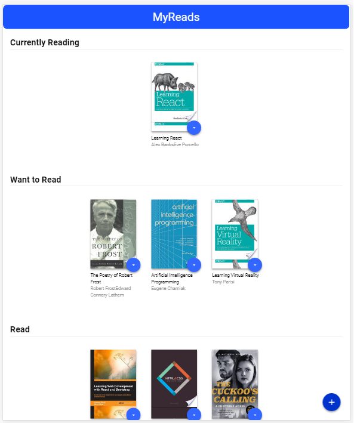

# MyReads Project 

This project is implemented as part of Udacity Front-end Web Developer Nanodegree. 

This is the bookshelf app that allows to select and categorize books you have read, are currently reading, or want to read.

On the main page there is a link to the search page, where it's possible to find books to add to the library.

The app is build using React.

# Installation

1. clone the repository
2. install all project dependencies with 'npm install'
3. start the development server with 'npm start'

